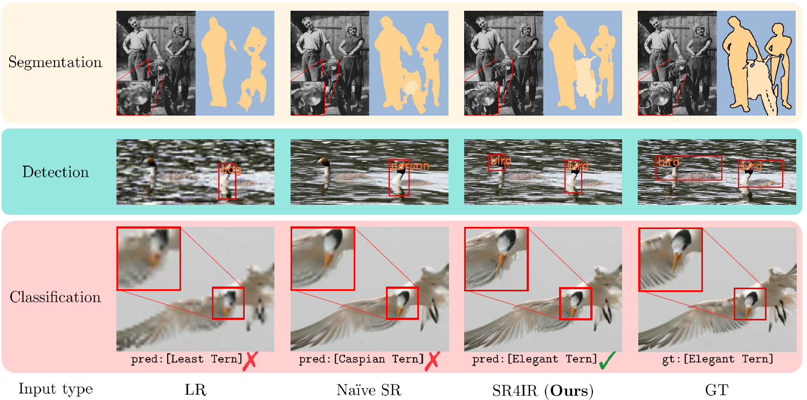

# SR4IR [CVPR 2024]
This repository is an official implementation of the paper **"Beyond Image Super-Resolution for Image Recognition with Task-Driven Perceptual Loss** (CVPR 2024)". [[**arXiv**](https://arxiv.org/abs/2404.01692)]

### Abstract
>In real-world scenarios, image recognition tasks, such as semantic segmentation and object detection, often pose greater challenges due to the lack of information available within low-resolution (LR) content. Image super-resolution (SR) is one of the promising solutions for addressing the challenges. However, due to the ill-posed property of SR, it is challenging for typical SR methods to restore task-relevant high-frequency contents, which may dilute the advantage of utilizing the SR method. Therefore, in this paper, we propose **S**uper-**R**esolution **f**or **I**mage **R**ecognition (SR4IR) that effectively guides the generation of SR images beneficial to achieving satisfactory image recognition performance when processing LR images. The critical component of our SR4IR is the task-driven perceptual (TDP) loss that enables the SR network to acquire task-specific knowledge from a network tailored for a specific task. Moreover, we propose a cross-quality patch mix and an alternate training framework that significantly enhances the efficacy of the TDP loss by addressing potential problems when employing the TDP loss. Through extensive experiments, we demonstrate that our SR4IR achieves outstanding task performance by generating SR images useful for a specific image recognition task, including semantic segmentation, object detection, and image classification.


<div align="center">
(Input type of LR, Naive SR stands for L->T, S->T setting in our main manuscript)
</div>

## Instructions

Please follow the below instructions.

1. [**Installation**](assets/docs/Installation.md)
2. [**Training**](assets/docs/Training.md) (skip if test-only)
3. [**Testing**](assets/docs/Testing.md) (including pre-trained models)

## Citation

If you find our work helpful for your research, please cite our paper.

```
@inproceedings{kim2024SR4IR,
  title={Beyond Image Super-Resolution for Image Recognition with Task-Driven Perceptual Loss},
  author={Kim, Jaeha and Oh, Junghun and Lee, Kyoung Mu},
  booktitle={Proceedings of the IEEE Conference on Computer Vision and Pattern Recognition},
  year={2024}
}
```

## Acknowledgement

Our code implementations are motivated by the below codes. We thank the authors for sharing the awesome repositories.
- [TorchVision](https://github.com/pytorch/vision/tree/main/references)
- [BasicSR](https://github.com/XPixelGroup/BasicSR)
- [VOC2COCO](https://github.com/yukkyo/voc2coco)


## Contact
If you have any questions, please email `jhkim97s2@gmail.com`.

